# Vancouver-airbnb-pricing trends for  most popular neighbourhoods-blogpost

###  A review of the Vancouver's air bnb data-UDacity-CrispDM Project

#### BUSINESS UNDERSTANDING

The data sets obtained for the analysis of  vancouver air bnb market contain property listing data set, calendar data set, and reviews data set. All these data set gives us insights about the Vancouver air bnb market. We will use these data set in tandem to find corrleations and answer the following questions.  

Pricing correlation:
* How does price correlates with seasons of year?
* How the type of property impacts the listing price in Vancouver??
* Dependance of listing price on the neighbourhoods in Vancouver?


Analysis of Reviews:
- Understanding how reviews impact the occupancy rate
- Get a correlation of the reviews with the neighbourhoods in vancouver
- Can we explore some of the worst reviews for additional insights?


Influence of parameters on availability:
- Cancellation policy
- Room type
- Number of guests
- Guests picture


    

### Data set review

Now we look at all the data sets to find their characteristics and if they have null values, we will is.null() functionality to check the missing values and will use the .describe() to get some sense of features for each column.

Questions to be answered for data review
1. Are there any missing values?
2. What are the features of each column?


Below analysis show that the vancouver hosts respond very efficiently


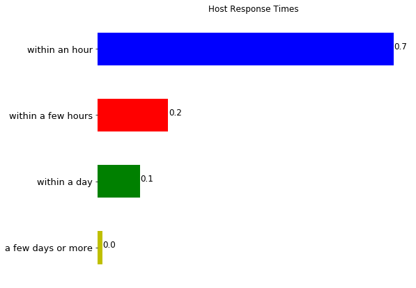


It can be seen that approximately 70% of the hosts in metro vancouver respond with in an hour. There are various types of properties available in Vancouver in the Air bnb platform. Below is the breakdown


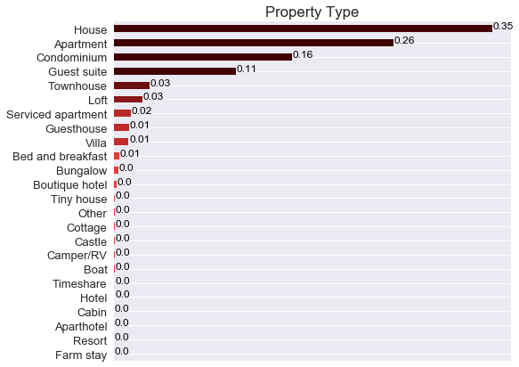

Approximately 35% of the properties listed on Vancouver Air bnb are houses and 26% are apartments

### Question 1 - Price correlations
1. Understand the correlation between price and the season of the year, and detect the peak season in Vancouver
2. To get an understanding of price correlation with the neighbourhoods in vancouver
3. Getting an insight into the relationship between the listed pricing and the property type in metro vancovuer


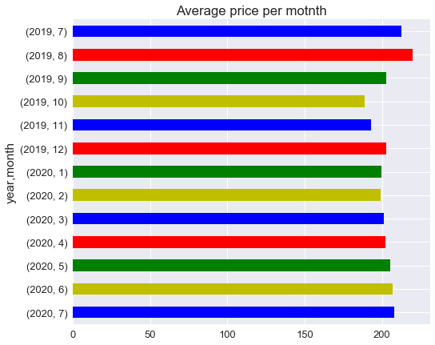

July-September seems to be the peak season in Vancouver


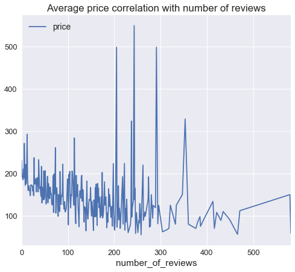


As we can see that listing price is higher for the number of reviews between 200-300, as the number of reviews increase we can see that price drops, which suggests that more customer tend to review places which are economical, however places with 200-300 tend to have higher listing price. 

Now we look at the neighbourhood and their pricings


    


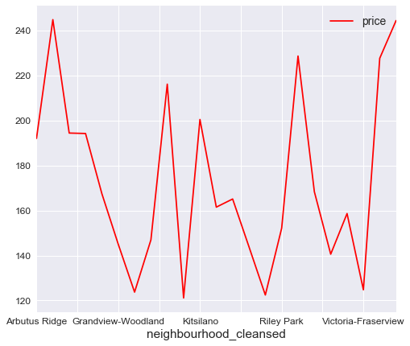


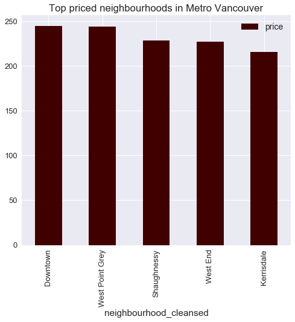


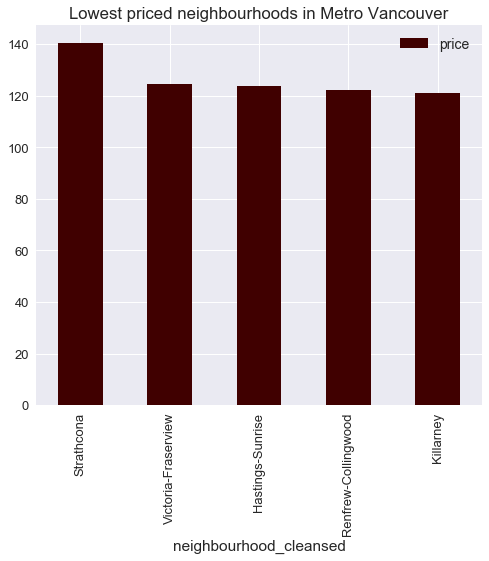


It can be seen from the charts above that the highest average price listed per night is $250 and cheapest is $120 per night in metro Vancouver.


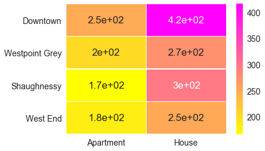


It can be seen from the heatmap above that Houses in downtown Vancouver area have higher listing price than apartments. 


### Question 02 - Review correlation

- Understanding how reviews impact the occupancy rate
- Get a correlation of the reviews with the neighbourhoods in vancouver
- Can we explore some of the worst reviews for additional insights?

let us look at the data in the review and listing table and also calcualte the occupancy rate from the listing can calendar table


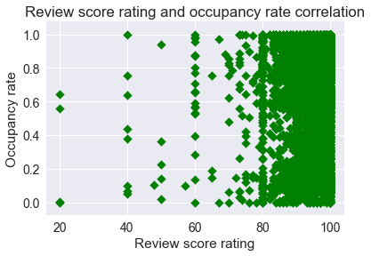


```python
f, axs = plt.subplots(7,figsize=(5,35))
axs[0].scatter(data['review_scores_rating'], data['percentage'], color = 'green', marker = 'D')
axs[1].scatter(data['review_scores_accuracy'], data['percentage'], color = 'blue', marker = 'o')
axs[2].scatter(data['review_scores_cleanliness'], data['percentage'], color = 'red', marker = '2')
axs[3].scatter(data['review_scores_location'], data['percentage'], color = 'black', marker = 'v')
axs[4].scatter(data['review_scores_communication'], data['percentage'], color = 'blue', marker = 'o')
axs[5].scatter(data['review_scores_checkin'], data['percentage'], color = 'red', marker = '2')
axs[6].scatter(data['review_scores_value'], data['percentage'], color = 'black', marker = 'v')

axs[0].set_title('Review scores rating corrleation with occupany rate')
axs[1].set_title('Review score accuracy corrleation with occupany rate')
axs[2].set_title('Review score cleanliness corrleation with occupany rate')
axs[3].set_title('Review score location corrleation with occupany rate')
axs[4].set_title('Review score communication corrleation with occupany rate')
axs[5].set_title('Review score checkin corrleation with occupany rate')
axs[6].set_title('Review score value corrleation with occupany rate')

axs[0].set_ylabel('occupancy rate')
axs[1].set_ylabel('occupancy rate')
axs[2].set_ylabel('occupancy rate')
axs[3].set_ylabel('occupancy rate')
axs[4].set_ylabel('occupancy rate')
axs[5].set_ylabel('occupancy rate')
axs[6].set_ylabel('occupancy rate')


```


    Text(0,0.5,'occupancy rate')


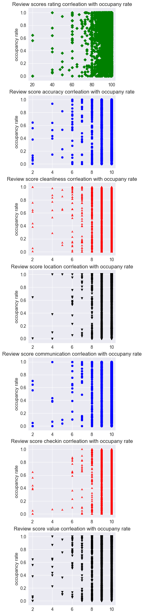


##### Results
Review rates are higher for properties with high occupancy rate. This could be either bad review or good review


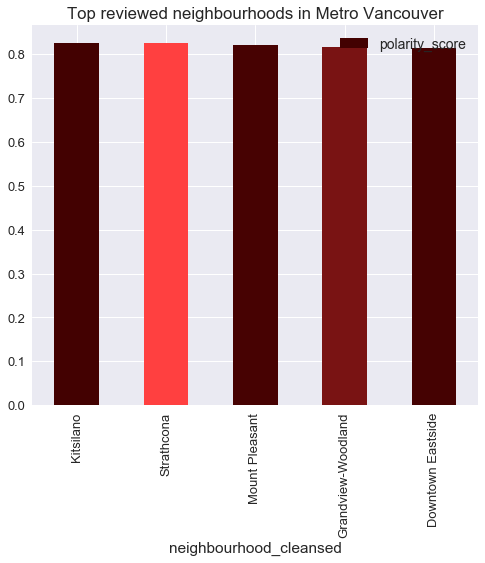


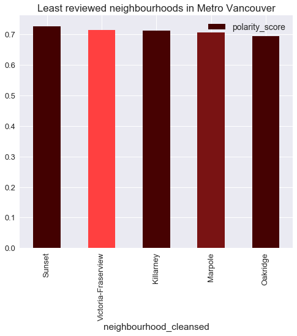


### Question # 03

Now we will look at the influence of parameters such as below on the availability rate 
- Cancellation policy
- Room type
- Number of guests
- Guests picture


First we try to clean the data and deal with the missing values, For bathrooms column, there are two missing values, but a property must have atleast 1 bathroom, so we will use 1 to fill the NA. We will also drop unnecessary columns


```python
dfl2 = data.copy()

dfl2 = dfl2.drop(['id','listing_url','scrape_id','last_scraped','thumbnail_url','medium_url','xl_picture_url','host_id','host_url','host_thumbnail_url','host_verifications','street','neighbourhood','neighbourhood_group_cleansed','zipcode','smart_location','country','experiences_offered','market','jurisdiction_names','latitude','host_acceptance_rate', 'longitude','weekly_price','monthly_price','calendar_updated','calendar_last_scraped','first_review','last_review','calculated_host_listings_count','reviews_per_month', 'square_feet'], axis= 1)
```


```python
dfl2.shape
```


    (5975, 74)


```python
dfl2.isnull().sum()
```


    name                                               0
    summary                                          161
    space                                           1188
    description                                       72
    neighborhood_overview                           1594
    notes                                           2922
    transit                                         1606
    access                                          2064
    interaction                                     1860
    house_rules                                     1552
    picture_url                                        0
    host_name                                          7
    host_since                                         7
    host_location                                     14
    host_about                                      2270
    host_response_time                               532
    host_response_rate                               532
    host_is_superhost                                  7
    host_picture_url                                   7
    host_neighbourhood                               598
    host_listings_count                                7
    host_total_listings_count                          7
    host_has_profile_pic                               7
    host_identity_verified                             7
    neighbourhood_cleansed                             0
    city                                               0
    state                                              3
    country_code                                       0
    is_location_exact                                  0
    property_type                                      0
                                                    ... 
    minimum_maximum_nights                             0
    maximum_maximum_nights                             0
    minimum_nights_avg_ntm                             0
    maximum_nights_avg_ntm                             0
    has_availability                                   0
    availability_30                                    0
    availability_60                                    0
    availability_90                                    0
    availability_365                                   0
    number_of_reviews                                  0
    number_of_reviews_ltm                              0
    review_scores_rating                             914
    review_scores_accuracy                           916
    review_scores_cleanliness                        915
    review_scores_checkin                            919
    review_scores_communication                      916
    review_scores_location                           918
    review_scores_value                              918
    requires_license                                   0
    license                                         1097
    instant_bookable                                   0
    is_business_travel_ready                           0
    cancellation_policy                                0
    require_guest_profile_picture                      0
    require_guest_phone_verification                   0
    calculated_host_listings_count_entire_homes        0
    calculated_host_listings_count_private_rooms       0
    calculated_host_listings_count_shared_rooms        0
    listing_id                                         0
    percentage                                         0
    dtype: int64


```python
dfl3 = dfl2.select_dtypes(include=['float', 'int'])
```


```python
dfl3.isnull().sum()
```


    host_listings_count              7
    host_total_listings_count        7
    bathrooms                        2
    bedrooms                         4
    beds                             5
    price                            0
    minimum_nights_avg_ntm           0
    maximum_nights_avg_ntm           0
    review_scores_rating           914
    review_scores_accuracy         916
    review_scores_cleanliness      915
    review_scores_checkin          919
    review_scores_communication    916
    review_scores_location         918
    review_scores_value            918
    percentage                       0
    dtype: int64


```python
dfl2['bathrooms'] = dfl2['bathrooms'].fillna(1)


dfl2['bedrooms'] = dfl2['bedrooms'].fillna(1)


dfl2['beds'] = dfl2['beds'].fillna(1)
dfl2['host_listings_count'] = dfl2['host_listings_count'].fillna(1)
dfl2['host_total_listings_count'] = dfl2['host_total_listings_count'].fillna(1)

dfl2['review_scores_rating'] = dfl2['review_scores_rating'].fillna(0)

dfl2['review_scores_accuracy'] = dfl2['review_scores_accuracy'].fillna(0)

dfl2['review_scores_cleanliness'] = dfl2['review_scores_cleanliness'].fillna(0)

dfl2['review_scores_checkin'] = dfl2['review_scores_checkin'].fillna(0)

dfl2['review_scores_rating'] = dfl2['review_scores_rating'].fillna(0)
dfl2['review_scores_communication'] = dfl2['review_scores_communication'].fillna(0)
dfl2['review_scores_value'] = dfl2['review_scores_value'].fillna(0)
dfl2['review_scores_location'] = dfl2['review_scores_location'].fillna(0)
```


```python
dfl3 = dfl2.select_dtypes(include=['float', 'int'])
dfl3.isnull().sum()
```


    host_listings_count            0
    host_total_listings_count      0
    bathrooms                      0
    bedrooms                       0
    beds                           0
    price                          0
    minimum_nights_avg_ntm         0
    maximum_nights_avg_ntm         0
    review_scores_rating           0
    review_scores_accuracy         0
    review_scores_cleanliness      0
    review_scores_checkin          0
    review_scores_communication    0
    review_scores_location         0
    review_scores_value            0
    percentage                     0
    dtype: int64


Now none of integer and float  type columns have missing values. 


```python
dfl2.select_dtypes(include=['object']).columns
```


    Index(['name', 'summary', 'space', 'description', 'neighborhood_overview',
           'notes', 'transit', 'access', 'interaction', 'house_rules',
           'picture_url', 'host_name', 'host_since', 'host_location', 'host_about',
           'host_response_time', 'host_response_rate', 'host_is_superhost',
           'host_picture_url', 'host_neighbourhood', 'host_has_profile_pic',
           'host_identity_verified', 'neighbourhood_cleansed', 'city', 'state',
           'country_code', 'is_location_exact', 'property_type', 'room_type',
           'bed_type', 'amenities', 'security_deposit', 'cleaning_fee',
           'extra_people', 'has_availability', 'requires_license', 'license',
           'instant_bookable', 'is_business_travel_ready', 'cancellation_policy',
           'require_guest_profile_picture', 'require_guest_phone_verification'],
          dtype='object')


```python
dfl2['host_response_time'] = dfl2['host_response_time'].fillna('N/A')


dfl2['host_response_rate'] = dfl2['host_response_rate'].apply(lambda x: 0 if x == 'N/A' else x)
dfl2['host_response_rate'] = dfl2['host_response_rate'].replace('[\%,]', '', regex=True).astype(float)
dfl2['host_response_rate'] = dfl2['host_response_rate'].fillna(0)

# Drop record with empty value for property_type
dfl2 = dfl2.dropna(subset=['property_type'], axis=0)

# Removing $ symbol from all the fees
dfl2['security_deposit'] = dfl2['security_deposit'].replace('[\$,]', '', regex=True).astype(float)
dfl2['cleaning_fee'] = dfl2['cleaning_fee'].replace('[\$,]', '', regex=True).astype(float)
dfl2['extra_people'] = dfl2['extra_people'].replace('[\$,]', '', regex=True).astype(float)
dfl2['security_deposit'] = dfl2['security_deposit'].fillna(0)
dfl2['cleaning_fee'] = dfl2['cleaning_fee'].fillna(0)


#making, citites,state lower case for uniformity
dfl2['city'] = dfl2['city'].str.lower()
dfl2['city'] = dfl2['city'].str.strip()
dfl2['state'] = dfl2['state'].str.lower()
```

Now we will make xome box plots to visulaizecorrelation between parameters and the occupancy rate


```python

top = dfl2[['property_type','require_guest_profile_picture', 'guests_included',   'cancellation_policy','room_type', 'percentage']]

```


```python
# Now we are going to make a box plot to see the relationship

boxplot1 = top.boxplot(column= 'percentage', by ='room_type', fontsize = 12, figsize = (8,7), grid = False)
boxplot1.set_xlabel('Room Type')
boxplot1.set_ylabel('Occupancy Rate')

boxplot1.get_figure().gca().set_title(" ")
boxplot1.get_figure().suptitle('Relationship of room type with occupancy rate')
```


    Text(0.5,0.98,'Relationship of room type with occupancy rate')


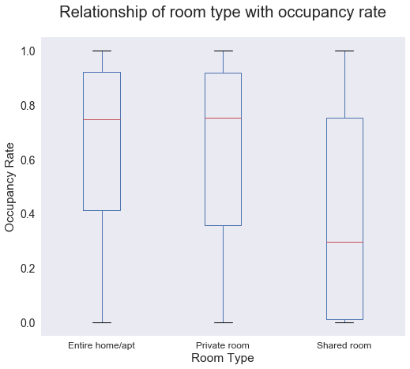


```python
top.groupby(['room_type'])[['percentage']].mean().sort_values(by = 'percentage', ascending = False)
```


<div>
<table border="1" class="dataframe">
  <thead>
    <tr style="text-align: right;">
      <th></th>
      <th>percentage</th>
    </tr>
    <tr>
      <th>room_type</th>
      <th></th>
    </tr>
  </thead>
  <tbody>
    <tr>
      <th>Entire home/apt</th>
      <td>0.650530</td>
    </tr>
    <tr>
      <th>Private room</th>
      <td>0.636747</td>
    </tr>
    <tr>
      <th>Shared room</th>
      <td>0.410218</td>
    </tr>
  </tbody>
</table>
</div>


##### Results
As we can see that entire homes, and private rooms are more popular than shared rooms and have very low availability. This is evident from the calcualted average above. 


```python
boxplot2 = top.boxplot(column= 'percentage', by ='property_type', fontsize = 12, figsize = (8,7), grid = False,  rot=90)
boxplot2.set_xlabel('Property Type')
boxplot2.set_ylabel('Occupancy Rate')

boxplot2.get_figure().gca().set_title(" ")
boxplot2.get_figure().suptitle('Relationship of property type with occupancy rate')
```


    Text(0.5,0.98,'Relationship of property type with occupancy rate')


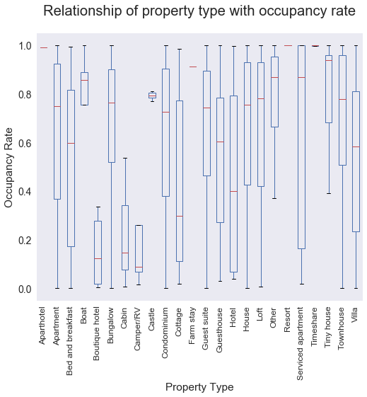


##### Results

Botique hotels are the least occupied property in metro vancouver


```python
top.groupby(['property_type'])[['percentage']].mean().sort_values(by = 'percentage', ascending = False)
```


<div>
<table border="1" class="dataframe">
  <thead>
    <tr style="text-align: right;">
      <th></th>
      <th>percentage</th>
    </tr>
    <tr>
      <th>property_type</th>
      <th></th>
    </tr>
  </thead>
  <tbody>
    <tr>
      <th>Resort</th>
      <td>1.000000</td>
    </tr>
    <tr>
      <th>Timeshare</th>
      <td>0.998630</td>
    </tr>
    <tr>
      <th>Aparthotel</th>
      <td>0.991781</td>
    </tr>
    <tr>
      <th>Farm stay</th>
      <td>0.912329</td>
    </tr>
    <tr>
      <th>Boat</th>
      <td>0.802192</td>
    </tr>
    <tr>
      <th>Castle</th>
      <td>0.792329</td>
    </tr>
    <tr>
      <th>Tiny house</th>
      <td>0.779795</td>
    </tr>
    <tr>
      <th>Other</th>
      <td>0.774658</td>
    </tr>
    <tr>
      <th>Townhouse</th>
      <td>0.699698</td>
    </tr>
    <tr>
      <th>Loft</th>
      <td>0.664340</td>
    </tr>
    <tr>
      <th>Serviced apartment</th>
      <td>0.661554</td>
    </tr>
    <tr>
      <th>Guest suite</th>
      <td>0.659320</td>
    </tr>
    <tr>
      <th>House</th>
      <td>0.656108</td>
    </tr>
    <tr>
      <th>Bungalow</th>
      <td>0.639530</td>
    </tr>
    <tr>
      <th>Apartment</th>
      <td>0.638824</td>
    </tr>
    <tr>
      <th>Condominium</th>
      <td>0.634759</td>
    </tr>
    <tr>
      <th>Guesthouse</th>
      <td>0.548687</td>
    </tr>
    <tr>
      <th>Villa</th>
      <td>0.543201</td>
    </tr>
    <tr>
      <th>Bed and breakfast</th>
      <td>0.528325</td>
    </tr>
    <tr>
      <th>Hotel</th>
      <td>0.459589</td>
    </tr>
    <tr>
      <th>Cottage</th>
      <td>0.430594</td>
    </tr>
    <tr>
      <th>Camper/RV</th>
      <td>0.269589</td>
    </tr>
    <tr>
      <th>Cabin</th>
      <td>0.231050</td>
    </tr>
    <tr>
      <th>Boutique hotel</th>
      <td>0.189555</td>
    </tr>
  </tbody>
</table>
</div>


```python
boxplot3 = top.boxplot(column= 'percentage', by ='cancellation_policy', fontsize = 12, figsize = (8,7), grid = False,  rot=90)
boxplot3.set_xlabel('Cancellation Policy')
boxplot3.set_ylabel('Occupancy Rate')

boxplot3.get_figure().gca().set_title(" ")
boxplot3.get_figure().suptitle('Relationship of cancellation policy with occupancy rate')
```


    Text(0.5,0.98,'Relationship of cancellation policy with occupancy rate')


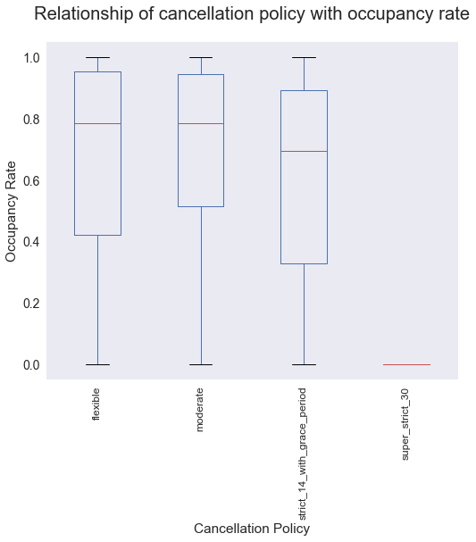


```python
top.groupby(['cancellation_policy'])[['percentage']].mean().sort_values(by = 'percentage', ascending = False)
```


<div>
<table border="1" class="dataframe">
  <thead>
    <tr style="text-align: right;">
      <th></th>
      <th>percentage</th>
    </tr>
    <tr>
      <th>cancellation_policy</th>
      <th></th>
    </tr>
  </thead>
  <tbody>
    <tr>
      <th>moderate</th>
      <td>0.695356</td>
    </tr>
    <tr>
      <th>flexible</th>
      <td>0.666213</td>
    </tr>
    <tr>
      <th>strict_14_with_grace_period</th>
      <td>0.614464</td>
    </tr>
    <tr>
      <th>super_strict_30</th>
      <td>0.000000</td>
    </tr>
  </tbody>
</table>
</div>


##### Results

Above results suggest that, properties with more moderate to flexible cancellation policy tend to have more demand and higher occupancy, whereas properties with more strict cancellation policy have more availability. This suggests that for higher profits, businesses should move towards more relaxed cancellation policy


```python
boxplot4 = top.boxplot(column= 'percentage', by ='guests_included', fontsize = 12, figsize = (8,7), grid = False)
boxplot4.set_xlabel('Number of guests')
boxplot4.set_ylabel('Occupancy Rate')

boxplot4.get_figure().gca().set_title(" ")
boxplot4.get_figure().suptitle('Relationship of number of guests with occupancy rate')
```


    Text(0.5,0.98,'Relationship of number of guests with occupancy rate')


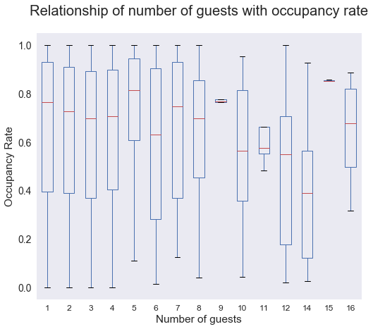


```python
top.groupby(['guests_included'])[['percentage']].mean().sort_values(by = 'percentage', ascending = False)
```


<div>
<table border="1" class="dataframe">
  <thead>
    <tr style="text-align: right;">
      <th></th>
      <th>percentage</th>
    </tr>
    <tr>
      <th>guests_included</th>
      <th></th>
    </tr>
  </thead>
  <tbody>
    <tr>
      <th>15</th>
      <td>0.860665</td>
    </tr>
    <tr>
      <th>5</th>
      <td>0.708476</td>
    </tr>
    <tr>
      <th>9</th>
      <td>0.705205</td>
    </tr>
    <tr>
      <th>1</th>
      <td>0.653536</td>
    </tr>
    <tr>
      <th>7</th>
      <td>0.651689</td>
    </tr>
    <tr>
      <th>11</th>
      <td>0.639726</td>
    </tr>
    <tr>
      <th>16</th>
      <td>0.639726</td>
    </tr>
    <tr>
      <th>2</th>
      <td>0.638048</td>
    </tr>
    <tr>
      <th>4</th>
      <td>0.635192</td>
    </tr>
    <tr>
      <th>8</th>
      <td>0.634219</td>
    </tr>
    <tr>
      <th>3</th>
      <td>0.623868</td>
    </tr>
    <tr>
      <th>6</th>
      <td>0.605355</td>
    </tr>
    <tr>
      <th>10</th>
      <td>0.539155</td>
    </tr>
    <tr>
      <th>12</th>
      <td>0.468493</td>
    </tr>
    <tr>
      <th>14</th>
      <td>0.387476</td>
    </tr>
  </tbody>
</table>
</div>


##### Results

Listings which can host from families upto a small group are high in demand


```python
boxplot5 = top.boxplot(column= 'percentage', by ='require_guest_profile_picture', fontsize = 12, figsize = (8,7), grid = False)
boxplot5.set_xlabel('Require guest profile photo')
boxplot5.set_ylabel('Occupancy Rate')

boxplot5.get_figure().gca().set_title(" ")
boxplot5.get_figure().suptitle('Relationship of guest profile photo with occupancy rate')
```


    Text(0.5,0.98,'Relationship of guest profile photo with occupancy rate')


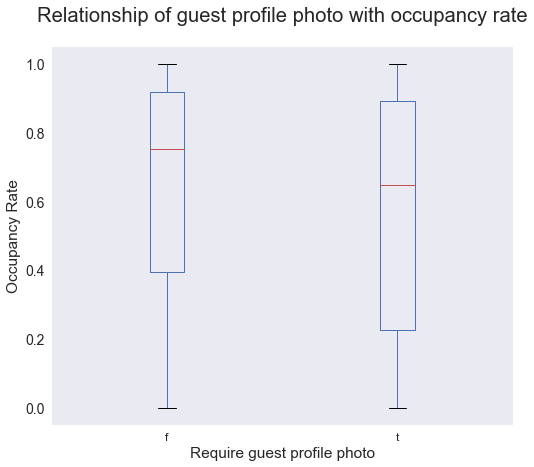


```python
top.groupby(['require_guest_profile_picture'])[['percentage']].mean().sort_values(by = 'percentage', ascending = False)
```


<div>
<table border="1" class="dataframe">
  <thead>
    <tr style="text-align: right;">
      <th></th>
      <th>percentage</th>
    </tr>
    <tr>
      <th>require_guest_profile_picture</th>
      <th></th>
    </tr>
  </thead>
  <tbody>
    <tr>
      <th>f</th>
      <td>0.646238</td>
    </tr>
    <tr>
      <th>t</th>
      <td>0.560999</td>
    </tr>
  </tbody>
</table>
</div>


##### Results
Properties that donot require guests profile photo for booking  has low availability and are more popular


```python

```
